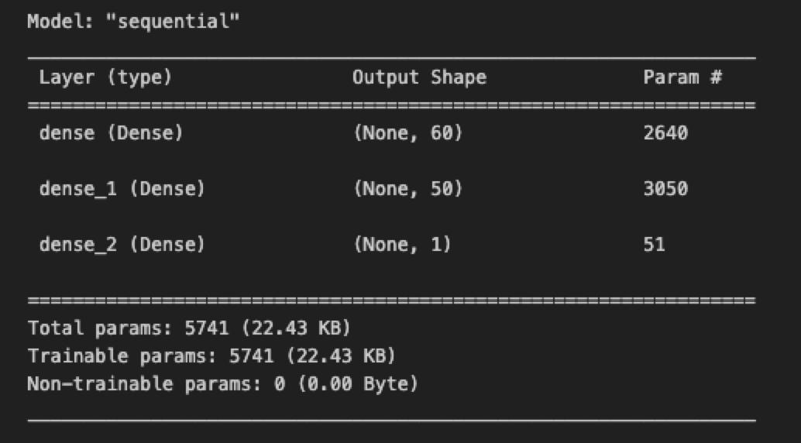

## Overview of the Analysis

**Purpose**
The purpose of the analysis is to train a model using data from the Alphabet Soup Foundation that will select applicants for funding with the best chances of success in their ventures. 

**Dataset**

The dataset is a CSV containing more than 34,000 organizations that have received funding from Alphabet Soup over the years. Within this dataset are a number of columns that capture metadata about each organization.

    - EIN and NAME — Identification columns

    - APPLICATION_TYPE — Alphabet Soup application type

    - AFFILIATION — Affiliated sector of industry

    - CLASSIFICATION — Government organization classification

    - USE_CASE — Use case for funding

    - ORGANIZATION — Organization type

    - STATUS — Active status

    - INCOME_AMT — Income classification

    - SPECIAL_CONSIDERATIONS — Special considerations for application

    - ASK_AMT — Funding amount requested

    - IS_SUCCESSFUL — Was the money used effectively

**Questions and Analysis**

- Data Preprocessing

    1. What variable(s) are the target(s) for your model?
        `IS_SUCCESSFUL is the target variable for the model to be used for predicting successful vs not successful outcomes`

    2. What variable(s) are the features for your model?
        `The features for the model include APPLICATION_TYPE; AFFILIATION; CLASSIFICATION; USE_CASE; ORGANIZATION; STATUS; INCOME_AMT; SPECIAL_CONSIDERATIONS; ASK_AMT`

    3. What variable(s) should be removed from the input data because they are neither targets nor features?
        `The EIN and NAME columns should be removed from the input data as these are identification columns only`
        
- Compiling, Training, and Evaluating the Model

    4. How many neurons, layers, and activation functions did you select for your neural network model, and why?
        `The model created contains 3 layers. Below is a screenshot of the neurons for the 2 hidden layers, and one output layer, as well as the activation functions utilized.`

        `Thew first and second hidden layers used ReLU activation functions as this is ideal for modeling positive, nonlinear input data for classification or regression. The output layer uses the Sigmoid function, which is ideal for this binary classification dataset .`

        `The neural network model was trained using 100 epochs in an attempt to train the model effectively, while avoiding overfitting.`

         
           
    5. Were you able to achieve the target model performance?
        `I was not able to achieve exactly 75%, but came close to the target model performance with a 73% accuracy.`

    6. What steps did you take in your attempts to increase model performance?
        `In an effort to increase the model performance, I tried modifying the hyperparameters such as the number of layers, training epochs, and the number of neurons in order to increase accuracy and reduce loss.`